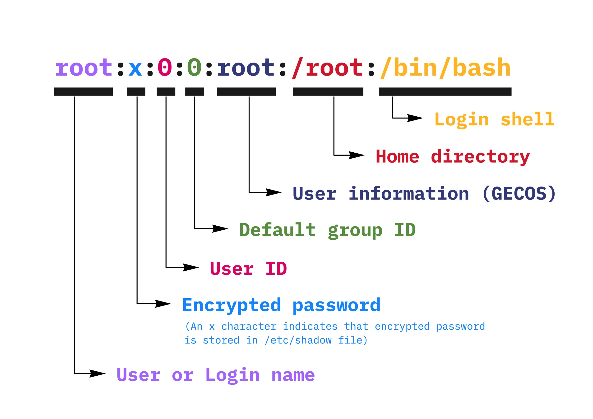
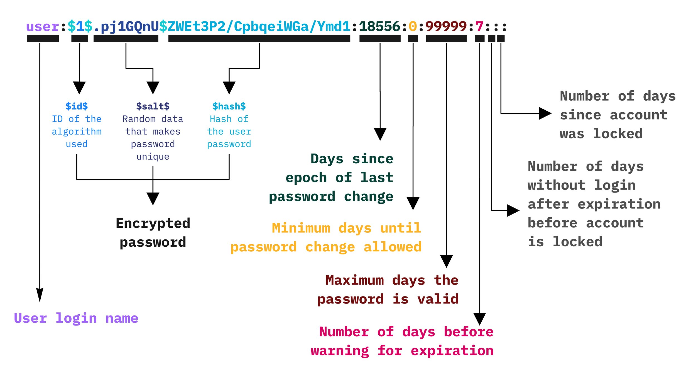

# suex

A lightweight privilege switching tool for executing programs with different user and group
permissions, `su` and `sudo` alternative.

# usrx

A companion utility for querying user information from system files (`/etc/passwd`, `/etc/group`,
and `/etc/shadow`).

# uarch

A simple utility for displaying system architecture names in a standardized format, particularly
useful for cross-platform development and build scripts.

## Purpose

`suex` is a utility that allows you to run programs with different user and group privileges.
Unlike traditional tools like `su` or `sudo`, `suex` executes programs directly rather than
as child processes, which provides better handling of TTY and signals.

**Important**: `suex` requires root privileges to operate as it performs uid/gid changes.

`usrx` provides a simple command-line interface to retrieve various user-related information
from system files. It can query basic user information, group memberships, and (with root
privileges) password-related data.

`uarch` is particularly useful in build scripts and CI/CD pipelines where consistent architecture
naming is required across different platforms.

## Key Features

### `suex` features
- Direct program execution (not spawning child processes)
- Support for both username/group names and numeric uid/gid
- Simpler and more streamlined than traditional `su`/`sudo`
- Better TTY and signal handling

### `usrx` features
- Comprehensive user information querying from system files
- Support for all standard user attributes (home, shell, groups, etc.)
- Fast and efficient group membership resolution
- Root-level access to shadow password information
- Formatted output for both single values and complete user profiles

### `uarch` features
- Maps system architecture to unofficial Linux architecture names
- Handles special cases for macOS architecture reporting
- Supports displaying original system architecture names
- Works consistently across Linux and macOS platforms

## `suex` usage

Basic syntax:
```shell
suex USER[:GROUP] COMMAND [ARGUMENTS...]
```

Where:
- `USER`: Username or numeric uid
- `GROUP`: (Optional) Group name or numeric gid
- `COMMAND`: The program to execute
- `ARGUMENTS`: Any additional arguments for the command

### Examples

Run nginx with specific user and group:
```shell
suex nginx:www-data /usr/sbin/nginx -c /etc/nginx/nginx.conf
```

Run a program with just a different user:
```shell
suex nobody /bin/program
```

Using numeric IDs:
```shell
suex 100:1000 /bin/program
```

## Advantages Over su/sudo

The main advantage of `suex` is its direct execution model. When using traditional tools
like `su`, commands are executed as child processes, which can lead to complications with
TTY handling and signal processing. `suex` avoids these issues by executing the program
directly.

```shell
# with su
$ docker run -it --rm alpine:edge su postgres -c 'ps aux'
PID   USER     TIME   COMMAND
    1 postgres   0:00 ash -c ps aux
   12 postgres   0:00 ps aux

# with suex
$ docker run -it --rm -v $PWD/suex:/sbin/suex:ro alpine:edge suex postgres ps aux
PID   USER     TIME   COMMAND
    1 postgres   0:00 ps aux
```

## `usrx` usage

Basic syntax:
```shell
usrx COMMAND [OPTIONS] USER
```

### `/etc/passwd` explained



### `/etc/shadow` explained



### Options

For `info` command:
- `-j` - Output information in JSON format
- `-i` - Skip encrypted password in output (useful for secure information display)

### Available Commands

Standard commands (available to all users):
- `info` - Display all available information about the user
  ```shell
  # Standard output
  $ usrx info username
  
  # JSON output
  $ usrx info -j username
  
  # Skip sensitive information
  $ usrx info -i username
  
  # JSON output without sensitive information
  $ usrx info -j -i username
  ```
- `home` - Print user's home directory
- `shell` - Print user's login shell
- `gecos` - Print user's GECOS field
- `id` - Print user's UID
- `gid` - Print user's primary GID
- `group` - Print user's primary group name
- `groups` - Print all groups the user belongs to

Root-only commands (requires root privileges):
- `passwd` - Print user's encrypted password
- `days` - Print detailed password aging information
- `check USER [PASSWORD]` - Verify if the provided password is correct
  - If PASSWORD is omitted, reads password securely from stdin
  - Returns exit code 0 if password is correct, 1 if incorrect

### JSON Output Format

When using the `-j` option with the `info` command, the output is structured as follows:

```json
{
  "user": "username",
  "group": "primary_group",
  "uid": 1000,
  "gid": 1000,
  "home": "/home/username",
  "shell": "/bin/bash",
  "gecos": "Full Name",
  "groups": [
    {"name": "group1", "gid": 1000},
    {"name": "group2", "gid": 1001}
  ],
  "shadow": {
    "encrypted_password": "...",
    "last_change": 19168,
    "min_days": 0,
    "max_days": 99999,
    "warn_days": 7,
    "inactive_days": -1,
    "expiration": -1
  }
}
```

Note: The `shadow` section is only included when running as root, and the `encrypted_password` field is omitted when using the `-i` option.

### Examples

Get user's home directory:
```shell
$ usrx home username
/home/username
```

List all groups for a user:
```shell
$ usrx groups username
users sudo docker developers
```

Get comprehensive user information (as root):
```shell
$ sudo usrx info username
User Information for 'username':
------------------------
Username: username
User ID: 1000
Primary group ID: 1000
Primary group name: username
Home directory: /home/username
Shell: /bin/bash
GECOS: John Doe
Groups: username(1000), sudo(27), docker(998)

Shadow Information (root only):
-----------------------------
[password and aging information]
```

Get user info in standard format:
```shell
$ usrx info username
```

Get user info in JSON format:
```shell
$ usrx info -j username
```

Get user info without sensitive data:
```shell
$ usrx info -i username
```

### Password Verification Examples

1. Exit codes:
```shell
# Returns exit code 0 if password is correct, 1 if incorrect
$ sudo usrx check username correctpassword
$ echo $?
0

$ sudo usrx check username wrongpassword
$ echo $?
1
```

2. Interactive password prompt:
```shell
$ sudo usrx check username
Password: [hidden input]
```

3. Password from command line (less secure):
```shell
$ sudo usrx check username mypassword
```

4. Password from file:
```shell
$ sudo usrx check username <password.txt
```

5. Password from pipe:
```shell
$ echo "mypassword" | sudo usrx check username
```

Note: The `check` command does not produce any output - it only sets the exit code.
For scripting, you can use it like this:

```shell
if sudo usrx check username userpassword; then
    echo "Password is correct"
else
    echo "Password is incorrect"
fi
```

### Security Notes

- The `passwd` and `days` commands require root privileges as they access `/etc/shadow`
- When installed setuid root (`sudo chmod u+s usrx`), these commands become available to all users
- Consider the security implications before setting the setuid bit
- The `check` command receives password as a command line argument which may expose it in:
    - Process listings (ps, top, etc.)
    - Shell history
    - System logs
    - Other system monitoring tools
    - When using file redirection or pipes, ensure that:
        - The password file has appropriate permissions (600 or more restrictive)
        - The password file is stored in a secure location
        - The file is securely deleted after use
        - The command is not visible in shell history
- For production use, consider more secure password verification methods

## `uarch` usage
```shell
uarch [-a]
```

Options:
- `-a` - Print system architecture instead of unofficial name
- `-h` - Show help message

## Attribution

`suex` is a reimplementation of [`su-exec`](https://github.com/ncopa/su-exec),
enhanced for improved usability and maintainability.
