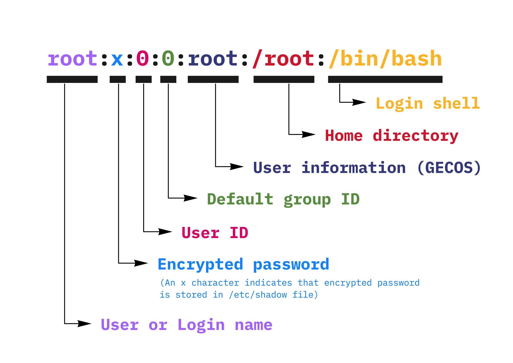
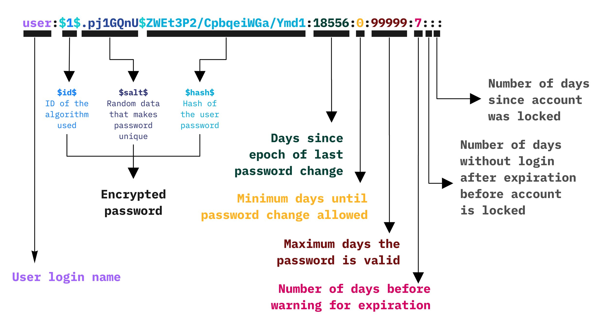

# suex & sush

**Lightweight privilege switching for the real world** — containers, CI pipelines, build systems, and anywhere `sudo` is overkill and `su-exec` is too blunt.

`suex` runs a command as another user. `sush` opens a shell as another user. Both use a direct `exec()` model with group-based access control. No config files. No password prompts. No daemons. No child processes.

```shell
# Drop from root to app user — clean exec, correct PID, proper signals
suex www-data nginx -g 'daemon off;'

# Switch users from a CI agent (must be in the suex group)
suex deploy /usr/local/bin/run-deployment

# Open an interactive shell as another user
sush postgres
```

---

## Why not sudo / su / gosu / su-exec?

| Tool | Direct exec | Access control | Correct supplementary groups | Size |
|---|---|---|---|---|
| `sudo` | yes | sudoers (complex) | yes | ~2MB + PAM |
| `su` | no (child process) | PAM | yes | ~50KB |
| `gosu` | yes | none | yes | ~1.8MB (Go runtime) |
| `su-exec` | yes | none | partial | ~10KB |
| **`suex`** | **yes** | **Unix group** | **yes** | **~70KB** |

The short version: `sudo` and `su` carry 45 years of multi-user timesharing assumptions into your container. `gosu` is correct but written in Go. `su-exec` is small and correct but has no access control — anyone who can execute it can become any user. `suex` adds group-based access control without any other overhead.

The longer version: [sudo is 45 Years Old. Your Container Doesn't Care.](https://github.com/mobydeck/suex/blob/main/ARTICLE.md)

---

## How it works

`suex` is a setuid root binary owned by root and executable only by members of the `suex` group. When invoked, it:

1. Verifies the caller is root or in the `suex` group (checked by the kernel before any C code runs)
2. Resolves the target user and group from `/etc/passwd`
3. Sets up the full supplementary group list via `setgroups()`
4. Calls `setgid()` then `setuid()`
5. Calls `execvp()` — replacing itself entirely with your command

After step 5, `suex` no longer exists in the process tree. Your command inherits the PID, file descriptors, and signal disposition directly. This is the same model the kernel uses for setuid binaries, applied to user switching.

```
# with su or sudo:
PID 1 → sudo → your-command

# with suex:
PID 1 → your-command
```

---

## Installation

### From source

```shell
git clone https://github.com/mobydeck/suex
cd suex
make install   # installs to /usr/local/bin by default
```

### Manual

Download the binary for your architecture from the [releases page](https://github.com/mobydeck/suex/releases), copy to `/usr/local/bin` or `/sbin`, then set permissions:

```shell
chown root:root suex sush
chmod 4755 suex sush
```

### In a Dockerfile

```dockerfile
COPY suex /sbin/suex
RUN chown root:root /sbin/suex && chmod 4755 /sbin/suex
```

---

## Setup

```shell
# Create the access control group
groupadd --system suex

# Restrict the binaries to the suex group (recommended for shared hosts)
chown root:suex suex sush
chmod 4750 suex sush

# Grant access to a user
usermod -a -G suex youruser
```

The `chmod 4750` breakdown: `4` sets the setuid bit, `7` gives root full access, `5` gives the `suex` group read+execute, `0` locks out everyone else. Users outside the group cannot execute the binary at all — the kernel enforces this before a single line of code runs.

For containers where any process can use `suex`, `chmod 4755` (world-executable) is fine.

---

## suex

Run a command as another user.

```shell
suex [-l] [USER[:GROUP]] COMMAND [ARGS...]
```

**Options**

- `-l` — login mode: clears the inherited environment and sets `HOME`, `USER`, `LOGNAME`, `SHELL`, `MAIL`, `PATH` for the target user. Working directory is unchanged.

**User specification**

- `USER` — username or numeric UID
- `USER:GROUP` — username and group name (or numeric IDs)
- `@USER` or `+USER` — prefix notation, same behavior
- Omitting USER defaults to root (non-root callers in the `suex` group only)

**Examples**

```shell
# Root dropping to a less privileged user
suex www-data nginx -g 'daemon off;'
suex nginx:www-data /usr/sbin/nginx -c /etc/nginx/nginx.conf
suex nobody /bin/program

# suex group member elevating to root
suex /usr/sbin/iptables -L

# suex group member switching to another user
suex deploy /usr/local/bin/run-deployment
suex @deploy:deploygroup /usr/bin/deploy-app

# Using numeric IDs
suex 100:1000 /bin/program

# Login mode — clean environment
suex -l postgres /usr/bin/pg_ctl start
suex -l www-data /usr/bin/configure-site
```

**Dual behavior**

- Called by root: steps down to a less privileged user (like `su`)
- Called by a `suex` group member: elevates to root or switches to any user (like a password-free, config-free `sudo`)

---

## sush

Open an interactive login shell as another user.

```shell
sush [-s SHELL] [USERNAME]
```

**Options**

- `-s SHELL` — use a specific shell instead of the user's default
- `USERNAME` — defaults to root if omitted

`sush` sets up a clean login environment (`HOME`, `USER`, `LOGNAME`, `SHELL`, `MAIL`, `PATH`, `TERM`), changes to the target user's home directory, and launches the shell with a leading dash in `argv[0]` — the Unix convention that triggers login shell initialization (`.profile`, `.bash_profile`, etc.).

PATH is always clean: `~/.local/bin` first, then the standard system path.

**Examples**

```shell
sush                      # root shell
sush postgres             # postgres user's default shell
sush -s /bin/zsh deploy   # zsh as the deploy user
```

Uses the same permission model as `suex` — requires membership in the `suex` group.

---

## Container pattern

The recommended entrypoint pattern for privilege-dropping containers:

```dockerfile
FROM debian:bookworm-slim

COPY suex /sbin/suex
RUN chown root:root /sbin/suex && chmod 4755 /sbin/suex

COPY entrypoint.sh /entrypoint.sh
ENTRYPOINT ["/entrypoint.sh"]
```

```shell
#!/bin/sh
# entrypoint.sh

# Root-only initialization
chown -R app:app /data
# ... other setup ...

# Hand off to the application — suex replaces itself via exec()
# Result: PID 1 is your app, running as app, no wrappers
exec suex app "$@"
```

The `exec` in the shell script replaces the shell with `suex`. `suex` then replaces itself with your application. Final result: one process, correct PID, correct user, correct signal handling.

---

## Security model

Access control is handled entirely by standard Unix file permissions — no policy files, no configuration, no parser.

**What you get:**
- Access restricted to the `suex` group, enforced by the kernel before any userspace code runs
- Full user context: correct UID, GID, and all supplementary groups
- Tiny, auditable codebase — no plugins, no shared library loading, no complex parsing
- Direct execution: no privilege manager remaining in the process tree

**What you trade:**
- No per-command whitelisting (if you need `alice` to run `systemctl` but not `bash`, use sudoers)
- No password prompts (access is determined by group membership)
- No per-command audit logging (group membership is your audit trail)

For environments that need fine-grained command authorization or mandatory password confirmation, `sudo` is the right tool. `suex` is for environments where that machinery is overhead.

---

## Additional utilities

### usrx

Query user information from system files.

```shell
usrx COMMAND [OPTIONS] USER
```

**Commands** (available to all users)

- `info [-j] [-i]` — full user profile; `-j` for JSON, `-i` to omit sensitive fields
- `home` — home directory
- `shell` — login shell
- `gecos` — GECOS field
- `id` — UID
- `gid` — primary GID
- `group` — primary group name
- `groups` — all group memberships

**Commands** (root only)

- `passwd` — encrypted password from `/etc/shadow`
- `days` — password aging information
- `check USER [PASSWORD]` — verify a password; reads from stdin if PASSWORD is omitted; exits 0 on match, 1 on failure

**JSON output**

```shell
usrx info -j username
```

```json
{
  "user": "username",
  "group": "primary_group",
  "uid": 1000,
  "gid": 1000,
  "home": "/home/username",
  "shell": "/bin/bash",
  "gecos": "Full Name",
  "groups": [
    {"name": "group1", "gid": 1000},
    {"name": "group2", "gid": 1001}
  ],
  "shadow": {
    "encrypted_password": "...",
    "last_change": 19168,
    "min_days": 0,
    "max_days": 99999,
    "warn_days": 7,
    "inactive_days": -1,
    "expiration": -1
  }
}
```

The `shadow` section only appears when running as root. `encrypted_password` is omitted with `-i`.

**`/etc/passwd` fields**



**`/etc/shadow` fields**



**Password verification**

```shell
# Script usage — only exit code matters, no output
if suex usrx check username "$PASSWORD"; then
    echo "correct"
fi

# From a file
suex usrx check username < password.txt

# Interactive prompt
suex usrx check username
```

Note: passing passwords as command-line arguments exposes them in process listings and shell history. Use stdin redirection in scripts.

---

### uarch

Print a normalized architecture name for use in build scripts and cross-platform tooling.

```shell
uarch        # normalized name: amd64, arm64, armv7, etc.
uarch -a     # original kernel name: x86_64, aarch64, armv7l, etc.
uarch -h     # help
```

Handles macOS architecture reporting quirks and maps kernel names to the names used by Linux package repositories and container registries.

---

## Attribution

`suex` is a reimplementation of [`su-exec`](https://github.com/ncopa/su-exec) by ncopa, with extended functionality: group-based access control, login mode, proper supplementary group initialization, and the `sush` companion tool.
